# Big Data Management Systems - Semester Project 2025: Data Streams | Azure Stream Analytics

In this project, we demonstrated the use of Azure Stream Analytics to process real-time data streams of ATM transactions.

---

> **Maria Schoinaki, BSc Student**  
> Department of Informatics, Athens University of Economics and Business  
> p3210191@aueb.gr  
>
> **Nikos Mitsakis, BSc Student**  
> Department of Informatics, Athens University of Economics and Business  
> p3210122@aueb.gr  

---

## Overview

The goal was to configure the Azure environment, ingest streaming data using Event Hub, perform stream analytics queries, and output results to Azure Blob Storage.

Schema of the ATM Transaction Stream:
(ATMCode, CardNumber, Type, Amount)

---

## Step 1: Create an Azure Trial Account

We registered for an Azure Free Trial account to access Azure cloud services required for this assignment.

**Screenshot:**  
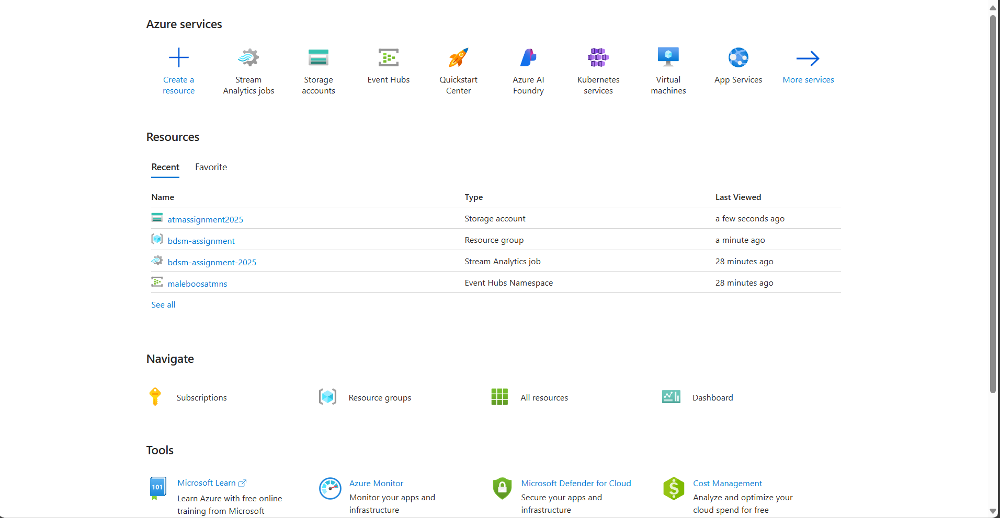

---

## Step 2: Setup an Event Hub

We created an Event Hub namespace and a hub to receive streaming ATM transaction events.

**Screenshot:**  
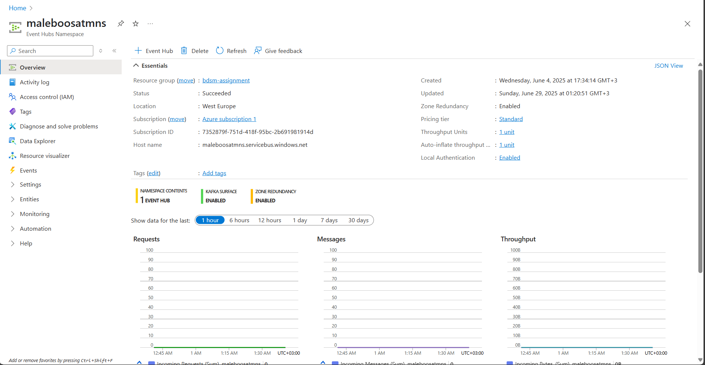

---

## Step 3: Generate a Security Access Signature (SAS)

We used the [RedDog Event Hub SAS Generator](https://github.com/sandrinodimattia/RedDog/releases) to create a SAS token for secure data publishing.

**Screenshot:**  
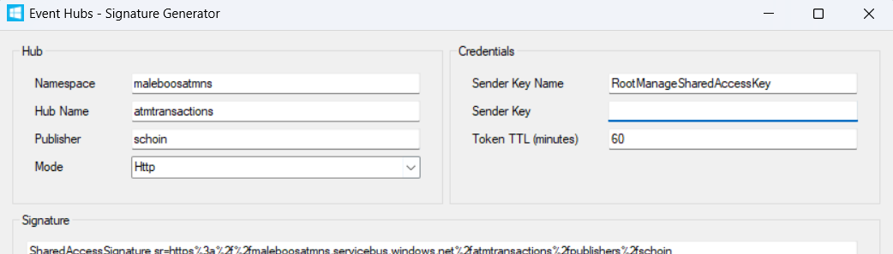

---

## Step 4: Edit Generator.html and Configure Variables

We updated the `Generator.html` file with our Event Hub config and the generated SAS token.

**Screenshot:**  
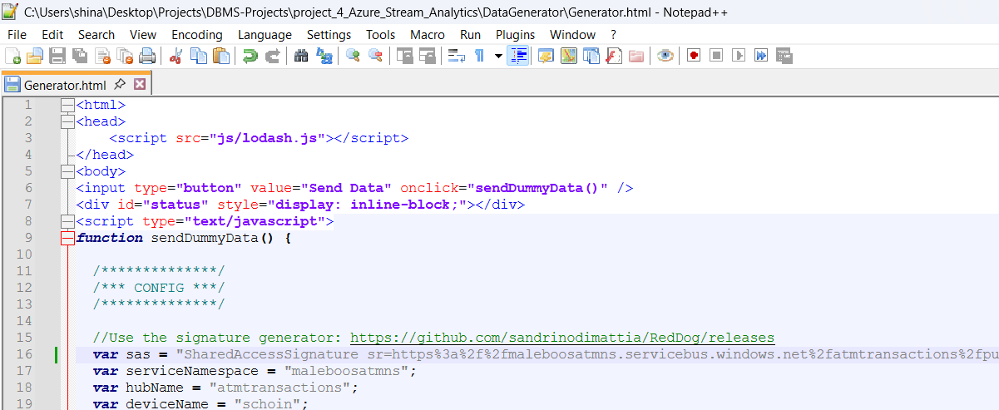

---

## Step 5: Feed Data into the Event Hub

We opened `Generator.html` in our browser and clicked “Send Data” to generate and send ATM transaction events to the Event Hub.

**Screenshot:**  
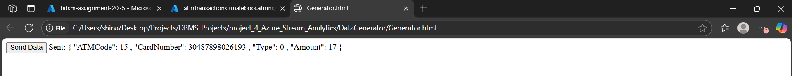

---

## Step 6: Setup a Storage Account

We created a Storage Account on Azure to store reference and output data.

**Screenshot:**  
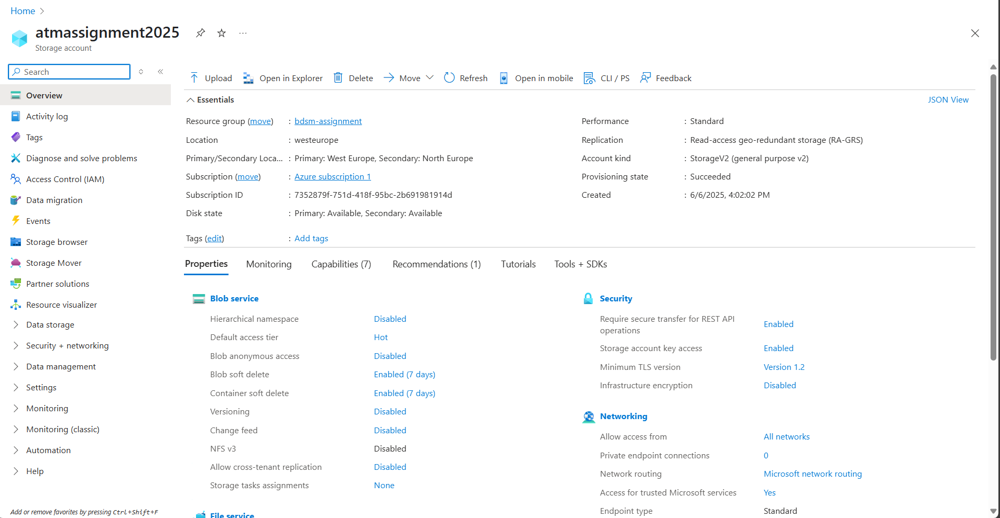

---

## Step 7: Upload Reference Data Files

We uploaded the provided reference data files to our Azure Storage account as required for the queries.

**Screenshot:**  
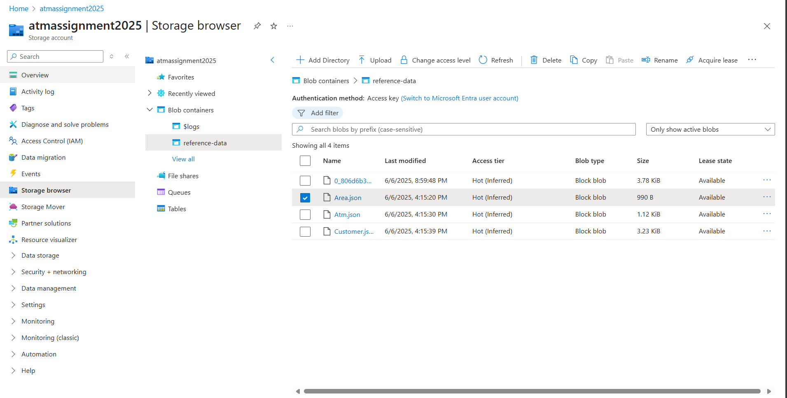

---

## Step 8: Setup a Stream Analytics Job

We created a Stream Analytics job to process incoming data streams.

**Screenshot:**  
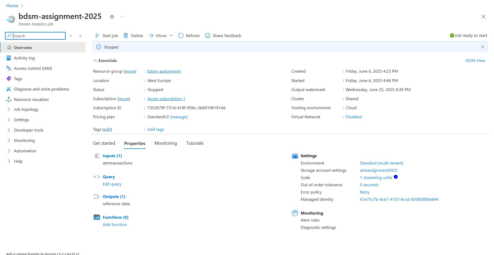

---

## Step 9: Configure Inputs (Event Hub + Reference Data)

We added our Event Hub as a streaming input and the reference data files as reference inputs in our Stream Analytics job.

**Screenshot:**  
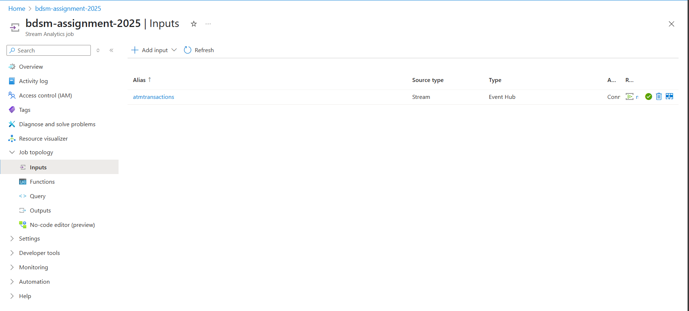

---

## Step 10: Create Blob Storage Output

We configured a Blob Storage output for the job results.

**Screenshot:**  
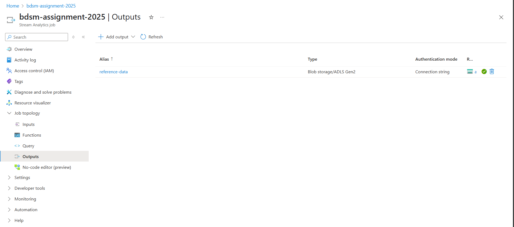

---

## Step 11: Run Stream Analytics Queries

We ran the required queries using the Stream Analytics Query Language.

### Query 1: Sliding Window (Last 10 Minutes, Type=0, ATMCode=21)

> Show the total “Amount” of “Type = 0” transactions at “ATM Code = 21” of the last 10 minutes. Repeat as new events keep flowing in (use a sliding window).

**Query:**
```sql
SELECT
    System.Timestamp AS WindowEnd,
    SUM(Amount) AS TotalAmount
INTO
    [reference-data] -- output alias
FROM
    [atmtransactions] -- input alias
WHERE
    Type = 0 AND ATMCode = 21
GROUP BY
    SLIDINGWINDOW(minute, 10)
```

This query outputs the running sum for all matching transactions in the previous 10 minutes.
It produces a result whenever a matching event arrives. Output times are not fixed-each output corresponds to an event’s time.

**Screenshot:**  
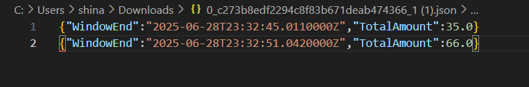

### Query 2: Tumbling Window (Last Hour, Type=1, ATMCode=21)

> Show the total “Amount” of “Type = 1” transactions at “ATM Code = 21” of the last hour. Repeat once every hour (use a tumbling window).

**Query:**
```sql
SELECT
    System.Timestamp AS WindowEnd,
    SUM(Amount) AS TotalAmount
INTO
    [reference-data]
FROM
    [atmtransactions]
WHERE
    Type = 1 AND ATMCode = 21
GROUP BY
    TUMBLINGWINDOW(hour, 1)
```

This query calculates the total transaction Amount for all transactions where Type = 1 and ATMCode = 21 for each fixed, non-overlapping 1-hour window. The results are produced once per hour at the end of each tumbling window.

**Screenshot:**  
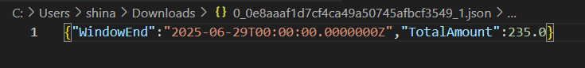

### Query 3: Hopping Window (Last Hour, Every 30 Minutes, Type=1, ATMCode=21)

> Show the total “Amount” of “Type = 1” transactions at “ATM Code = 21” of the last hour. Repeat once every 30 minutes (use a hopping window).

**Query:**
```sql
SELECT
    System.Timestamp AS WindowEnd,
    SUM(Amount) AS TotalAmount
INTO
    [reference-data]
FROM
    [atmtransactions]
WHERE
    Type = 1 AND ATMCode = 21
GROUP BY
    HOPPINGWINDOW(minute, 60, 30)
```

This generates overlapping 1-hour windows every 30 minutes, so each transaction may appear in up to two windows.

**Screenshot:**  
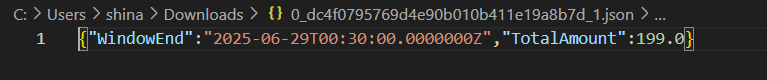

### Query 4: Sliding Window (Last Hour, Type=1, Per ATMCode)

> Show the total “Amount” of “Type = 1” transactions per “ATM Code” of the last one hour (use a sliding window).

**Query:**
```sql
SELECT
    System.Timestamp AS WindowEnd,
    ATMCode,
    SUM(Amount) AS TotalAmount
INTO
    [reference-data]
FROM
    [atmtransactions]
WHERE
    Type = 1
GROUP BY
    ATMCode,
    SLIDINGWINDOW(hour, 1)
```

This shows the running sum per ATMCode for the last hour, updating every time a new event is processed.

**Screenshot:**  
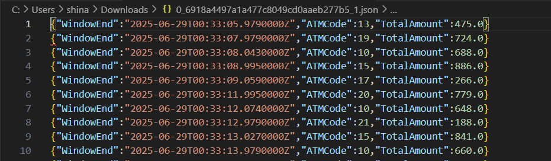

### Query 5: Tumbling Window (Last Hour, Type=1, Per Area Code)

> Show the total “Amount” of “Type = 1” transactions per “Area Code” of the last hour. Repeat once every hour (use a tumbling window).

We added as input stream the Atm.json with alias atmref
**Query:**
```sql
SELECT
    System.Timestamp AS WindowEnd,
    atmref.area_code,
    SUM(t.Amount) AS TotalAmount
INTO
    [reference-data]
FROM
    [atmtransactions] t
    JOIN [atmref] AS atmref
      ON t.ATMCode = atmref.atm_code
WHERE
    t.Type = 1
GROUP BY
    atmref.area_code,
    TUMBLINGWINDOW(hour, 1)
```

This produces a sum per Area Code for each 1-hour period.

**Screenshot:**  
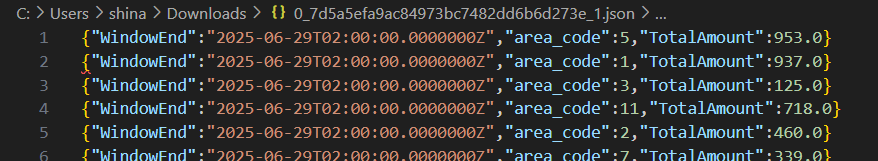

### Query 6: Tumbling Window (Last Hour, Per City & Gender)

> Show the total “Amount” per ATM’s “City” and Customer’s “Gender” of the last hour. Repeat once every hour (use a tumbling window).

We added as input reference the Customer.json with alias customer, the Area.json with alias area and the Atm.json with alias atmref
**Query:**
```sql
SELECT
    System.Timestamp AS WindowEnd,
    atmcity.area_city AS City,
    cust.gender AS Gender,
    SUM(t.Amount) AS TotalAmount
INTO
    [reference-data]
FROM
    [atmtransactions] t
    JOIN [atmref] AS atmref        -- ATM area code
      ON t.ATMCode = atmref.atm_code
    JOIN [area] AS atmcity         -- ATM city
      ON atmref.area_code = atmcity.area_code
    JOIN [customer] AS cust        -- Customer info
      ON t.CardNumber = cust.card_number
WHERE
    t.Type = 1
GROUP BY
    atmcity.area_city,
    cust.gender,
    TUMBLINGWINDOW(hour, 1)
```

This produces a breakdown per ATM city and gender for each hour.

**Screenshot:**  
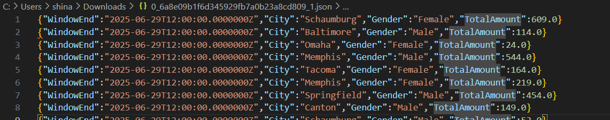

### Query 7: Sliding Window Alert (Customer, 2+ Transactions in 1 Hour, Type=1)

> Alert (SELECT “1”) if a Customer has performed two transactions of “Type = 1” in a window of an hour (use a sliding window).

**Query:**
```sql
SELECT
    CardNumber,
    1 AS Alert
INTO
    [reference-data]
FROM
    [atmtransactions]
WHERE
    Type = 1
GROUP BY
    CardNumber,
    SLIDINGWINDOW(hour, 1)
HAVING
    COUNT(*) >= 2
```

This outputs an alert whenever a customer has two or more Type=1 transactions in a 1-hour window.

**Screenshot:**  
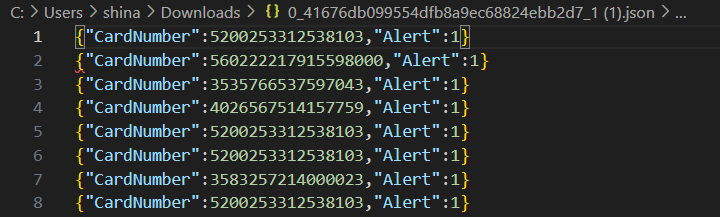

### Query 8: Sliding Window Alert (ATM AreaCode ≠ Customer AreaCode)

> Alert (SELECT “1”) if the “Area Code” of the ATM of the transaction is not the same as the “Area Code” of the “Card Number” (Customer’s Area Code) - (use a sliding window)

We added as input reference the Customer.json with alias customer and the Atm.json with alias atmref
**Query:**
```sql
SELECT
    t.ATMCode,
    t.CardNumber,
    1 AS Alert
INTO
    [reference-data]
FROM
    [atmtransactions] t
    JOIN [atmref] AS atmref
      ON t.ATMCode = atmref.atm_code
    JOIN [customer] AS cust
      ON t.CardNumber = cust.card_number
WHERE
    atmref.area_code <> cust.area_code
GROUP BY
    t.ATMCode, t.CardNumber, SLIDINGWINDOW(hour, 1)
```

This outputs an alert for any transaction where the customer’s area code does not match the ATM’s area code within a 1-hour sliding window.

**Screenshot:**  
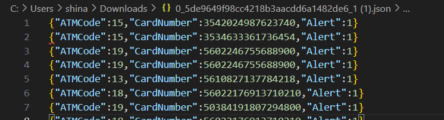


## References
- [Azure Stream Analytics Documentation](https://docs.microsoft.com/en-us/azure/stream-analytics/)
- [Azure Event Hubs Documentation](https://learn.microsoft.com/en-us/azure/event-hubs/)
