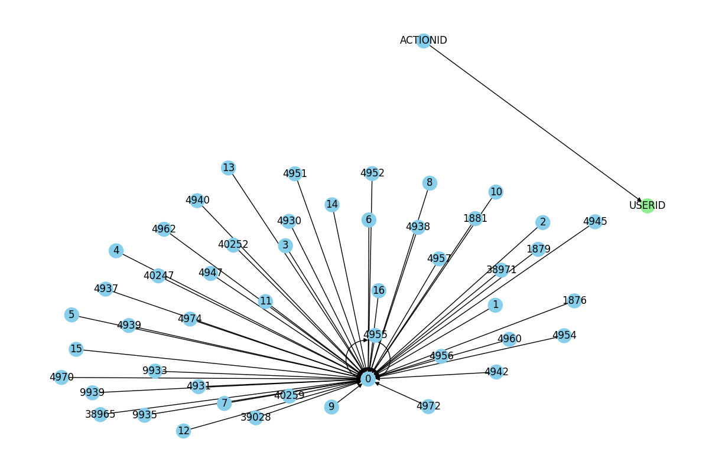

# Big Data Management Systems - Semester Project 2025: Graph Databases | Neo4j

In this project, we explored large-scale social network analysis by loading the MOOC User Action Dataset into Neo4j, running complex Cypher queries, and visualizing user interactions to uncover insights about online learning behaviors.

---

> **Maria Schoinaki, BSc Student**  
> Department of Informatics, Athens University of Economics and Business  
> p3210191@aueb.gr  
>
> **Nikos Mitsakis, BSc Student**  
> Department of Informatics, Athens University of Economics and Business  
> p3210122@aueb.gr  

---

## 📖 Overview

We explored large-scale social network analysis by loading the [MOOC User Action Dataset](https://snap.stanford.edu/data/act-mooc.html) into Neo4j, running complex Cypher queries, and visualizing user interactions to uncover insights about online learning behaviors. This project demonstrates how graph databases and Python can reveal valuable patterns in online education platforms.

---

## 🚀 Features

- Efficient data preprocessing and integration with **Pandas**
- Bulk graph construction in **Neo4j** using **Python**
- Clear property graph model: Users, Targets, and PERFORMS relationships
- Batch Cypher query execution and performance benchmarking
- Automated results export to CSV
- Graph visualization with **NetworkX** and **Matplotlib**

---

## 📁 Project Structure

```text
.
├── results/              # Query outputs and visualizations
├── solution.ipynb        # Main Jupyter notebook (well-commented and ready to run)
├── cypher_queries.txt    # All Cypher queries used in the analysis
├── requirements.txt      # Python dependencies
├── README.md             # This file
```

## Dataset

- **Source:** [Stanford SNAP MOOC User Action Dataset](https://snap.stanford.edu/data/act-mooc.html)
- **Files Used:**  
  - `mooc_actions.tsv`  
  - `mooc_action_features.tsv`  
  - `mooc_action_labels.tsv`

---

## Graph Model

- **Nodes:**
  - `User` (id)
  - `Target` (id)
- **Relationships:**
  - `(:User)-[:PERFORMS {action_id, timestamp, feature1, feature2, feature3, feature4, label}]->(:Target)`

---

## Main Steps

1. **Data Loading:**  
   - Read and merge the three original files using Pandas.
   - Extract and save unique users, targets, and all actions to CSV for Neo4j import.

2. **Neo4j Graph Import:**  
   - Move all processed files to the Neo4j import directory.
   - Use Python and Cypher’s `LOAD CSV` for efficient batch import, chunking actions for speed.

3. **Cypher Querying & Benchmarking:**  
   - Execute a series of analytic Cypher queries.
   - Save results to CSV and print query timings.

4. **Visualization:**  
   - Visualize a portion of the graph (users, targets, actions) using NetworkX and Matplotlib.

---

## Example Queries

- Show a small portion of your graph (screenshot)
- Count all users, all targets, all actions
- Show all actions (actionID) and targets (targetID) of a specific user
- For each user, count their actions
- For each target, count how many users have done this target
- Count the average actions per user
- Show userID and targetID for actions with positive Feature2
- For each targetID, count actions with label “1”

All queries are in [cypher_queries.txt](cypher_queries.txt).

---

## How to Reproduce

1. **Clone this repo**
2. Download the MOOC User Action Dataset and place it under `data/act-mooc/`
3. Open `solution.ipynb` and follow the steps (or run as a script)
4. Ensure your Neo4j Desktop server is running and the import directory path is correct
5. Run all cells to preprocess, import, query, and visualize

---

## Requirements

- Python 3.8+
- [Neo4j Desktop](https://neo4j.com/download/)
- `pandas`, `networkx`, `matplotlib`, `neo4j` (Python driver)

Install requirements with:

```bash
pip install pandas networkx matplotlib neo4j
```


## 📊 Graph Visualization

A sample of 50 `(User)-[:PERFORMS]->(Target)` relationships was visualized using NetworkX and Matplotlib.



**Visualization Explanation:**
- **Blue nodes:** represent individual `User` nodes (students).
- **Green nodes:** represent `Target` nodes (MOOC course resources or activities).
- **Directed edges:** show each action (`PERFORMS` relationship) from a user to a target.

**Interpretation:**  
The graph exhibits a *hub-and-spoke* structure with a central user connected to many targets,  
demonstrating that users often interact with multiple resources in a MOOC.  
The visualization validates the import and illustrates the many-to-many nature of online learning:  
one user can interact with many resources, and each resource can attract multiple users (not all shown here).  
This structure helps us visually inspect the diversity of engagement and forms a foundation for further network analysis.

---


## Environment & Dependencies

All dependencies are listed in `requirements.txt`. Key packages:

* `pandas`, `numpy`, `neo4j`, `networkx`, `matplotlib`, `tqdm`

To reproduce the environment:

```bash
pip install -r requirements.txt
```

---

## Key Outcomes

* \~250k actions ingested into Neo4j
* Cypher queries automated and saved
* Interactive graph visualization created
* Schema successfully mapped: user–action–target

---

## 📌 Notes

* CSVs must be manually placed in Neo4j Desktop's `import/` folder.
* The database reset includes a 30-second wait time to avoid premature connections.
* Ensure Neo4j Desktop is **running** before executing Python scripts.

---

## Authors

Developed by:

- Nikos Mitsakis  | 3210122
- Maria Schoinaki | 3210191